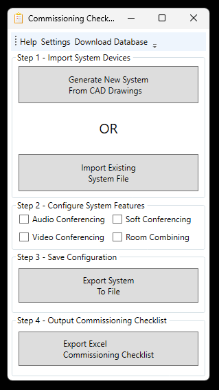
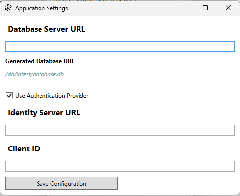
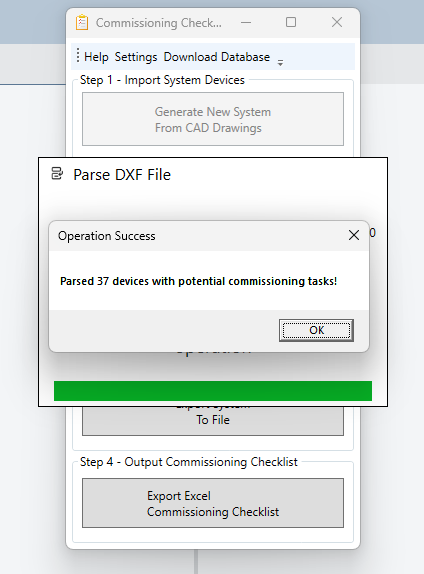
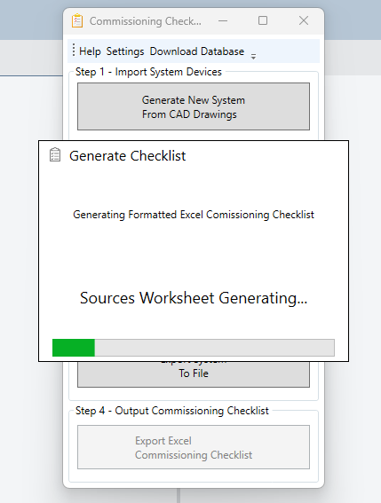

# Commissioning Checklist Generator

## Overview
This application is intended to streamline the process of comissioning av integration projects by nearly automatically generating a list of commissioning tasks for devices present in a system. 

Provided with a DXF or DWG file of a line drawing, it will parse any available devices from the system that can be commissioned by a Field Engineer or Quality Assurance Engineer and generate an Excel checklist containing pertinent tasks for that device. The application utilizes a SQLite database to determine what a device is capable of.

For example, a system expander *(denoted by the prefix **EXP**)* can be capable of expanding the audio, video, **or** control aspects of a system. Without knowing what type of expander is installed, the generator will retrieve all tasks a generic **EXP** device is capable of. By using the database, we can narrow down the capability of the device using it's checking the **model** of the device against the database. If the model of the expander in question is a QSC QIO-S4 for example, only the **control** related commissioning tasks will be retrieved, as that is the capabilities of a QIO-S4 as defined in the database.

## Configuration

### Application Settings

In the toolbar you will need to open the Settings window to configure the server url to download the remote database. An example database is hosted at: https://blajda-gen2.loginto.me. On the first startup, the application will show the configuration window before you can start using the application. This configuration will be saved to disk and used in the future. You will enable or disable SSO here; and you'll need to configure your database server accordingly.

### Database Configuration

SQLite scripts to get a new database fired up on your server can be found in the docs folder. A diagram of the relationships is also provided

### CAD Drawing Block Configuration

The blocks in your drawings **MUST** have the following attribute tags. These are used to determine what inserts in the CAD drawing are actually commissionable devices. Without this the application cannot 
parse out what devices it cares about, nor can it later on query the database to retrieve appropriate tasks later on when you try to generate the checklist.

- ID
	- a unique identifier for the device
		- CPR-101, MON-001, TPL-010 etc
	- this **MUST** be in the following format
		- XXX-NNN
			- XXX is an abbreviation for the device
				- CPR, MON, TPL
				- can be more than 3 characters
			- NNN is a numeric identifier of the instance of the unit in the system
				- 101, 001
				- can be more than 3 digits
			- see source code for regex pattern
> [!IMPORTANT] 
> 
> *the prefixes used here **MUST ALSO EXIST IN THE DATABASE** to retrieve device **PREFIX** level commissioning tasks*

- MAKE **or** MFG
	- the manufacturer of the device
	- this is just part of the database relationships, not used when generating tasks
- MODEL **or** PN
	- the model or part number of the device
	- when a checklist is generated, the application checks to see if a device matching the model exists. 
> [!IMPORTANT] 
> 
> *if commisioning tasks have been assigned at the device **MODEL** level, these override any device **PREFIX** level commissioning tasks*

- DESCRIPTION **or** DESC
	- not as important, but injected into the checklist in the device's checklist section, and may be useful to the QA or Field Engineer

## Usage

### Startup

The application will open the settings window when you run it for the first time prompting you to configure the server url that is hosting the sqlite database. If you dont configure this, youll never download updates and only have the embedded version of the database that the app was shipped with, which is limited in is functionality at this time. Configure this url to point at your server. If your server is configured for SSO authentication youll also need to configure those settings here.

> [!NOTE]
>
> *(the final database path is locked within the application. The text field beneath the server URL will update to show where you should host the database file on your server.)*

### Toolbar

The application toolbar has 3 options:

- Help
	- opens a small message box that hopefully provides assistance in using the app
- Settings 
	- allows you to configure the following
		- database server base url
			- the url to the server that hosts the database. the final database location is locked to **/db/latest/database.db**
				- the window will auto generate the final url based on this input, and will validate that your input is a valid url
				- you will not be able to save the configuration without a valid url here
		- use sso
			- sso authority endpoint
				- the base url of the authority to use for sso authentication. this authority must support openid-connect using the standard .well-known 
			- sso client id
				- the client id to use when authenticating to the authority
				- there is no validation on this input, as the client id could be anything
- Download Database
	- this is a manual override to immediately download a database update
	- use this as needed, by default the app will auto-download every hour while the app is running
	- a progress window will indicate download progress, and disable the download button until the download is complete or has failed

### Generating Checklists

#### Step 1 - Import Devices

To begin you'll need to import the devices from the system that can be configured. This can be done one of two ways, using the drawing parser, or an existing system
configuration file.

1. Import CAD File
	1. find & download the system flows DWG or DXF file from the CAD folder. 
	1. navigate to the downloaded file when the provided file dialog opens.
1. Import JSON File
	1. find the previously exported json file when the provided file dialog opens
> [!TIP] 
> 
> if you have used the generator previously on an identical system or are generating checklists for multiple rooms in a system; you should export/import the json file, which will be quicker than parsing the drawing file.
	
#### Step 2 - System Capabilities

After you have imported the devices, you need to indicate what other capabilities the system has. There are 4 options:

- Audio Conferencing
	- conferencing using a traditional POTS or VOIP connection *(typically via an installed DSP)*
- Video Conferencing
	- conferencing using a traditional hard codec *(Cisco, Polycom, Lifesize, etc)*
- Soft Conferencing
	- conferencing using an installed pc, or byod device *(Microsoft Teams, Zoom, Webex, etc)*
- Room Combining
	- either master/slave or true dynamic combining functionality

#### Step 3 - Save System Configuration

If you want to save the system configuration for re-use later, you can export the system devices and functionality to a json file that you can re-use later. Parsing the DXF file can take some time,
so using the configuration file will save time as it reads in the file directly. 

> [!TIP] 
> 
> this step is optional, but handy if projects in the future will contain an identical setup. Importing the JSON file is a much faster process than re-parsing the drawing file at a future date.

#### Step 4 - Generate Checklist

Lastly, its time to generate the checklist. This can take some time, so a progress window will show you the current step. Once completed, a file dialog will open to prompt you to save the excel checklist
to disk with the project number so other team members can easily identify the file.

#### Step 5 - Profit ?

After this, its up to you, either complete or hand off the checklist to the QA or Field Engineer, ideally this file should first be uploaded to sharepoint so that it can be accessed by the entire project team and updated in real-time.

## Checklist

The checklist is has pre-built conditional formatting that will colorize the row based on the completion status of the task, and is  broken out into a few worksheets to prevent visual overload:

- Sources
	- any audio or video device that acts as an input endpoint of content into the system
- Destinations
	- any audio or video device that acts as an output endpoint of content from the sytem
- User Interfaces
	- button panels, keypads, touchpanels, ipads, etc.
- Controlled Devices
	- any other device that doesnt fall into the previous 3 categories
- Soft Conferencing
	- tasks specific to using Teams, Zoom, Webex, etc
- Video Conferencing
	- tasks specific to hard codecs, Cisco, etc.
- Audio Conferencing
	- tasks specific to POTS or VOIP
- Room Combining
	- tasks specific to systems capable of combining

These worksheets will be generated automatically, or left out if no matching devies are found with such capability to warrant generating the worksheet.

## Troubleshooting

The application should handle all exceptions, and output the details of any errors or exceptions in the logs. A messagebox should be shown when or if an error occurs that a user should know about, either to resolve it or to provide the details to the staff managing the database server.

The database, configuration file, and logs are all stored in here (type into a file explorer) -> %LOCALAPPDATA%/CommissioningChecklistGenerator/

> [!CAUTION]
>
> modifying the configuration file directly wont break the app, but it could cause the application to no longer be able to authenticate against the SSO authority, or download from the database; don't modify it directly unless you know what you are doing. The only files in the appdata location that should be accessed are logs to provide to support.